# SlateDB Architecture

This document provides a visual overview of how the major components and structs
in the `slatedb` crate relate to each other — what contains what, what creates what,
and how data flows through the system.

## High-Level Component Overview

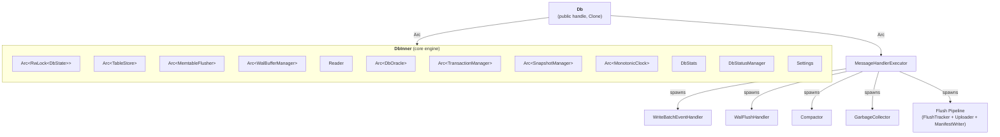

## DbState & Manifest

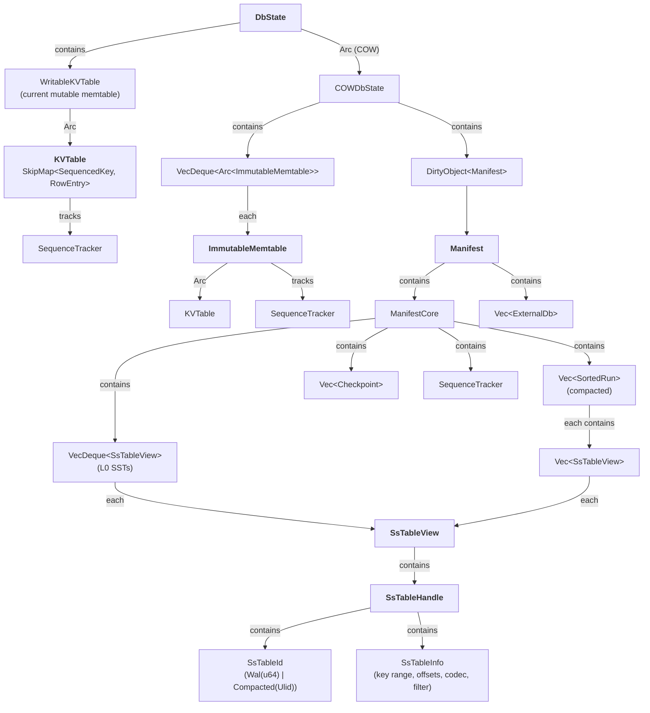

## Core Types

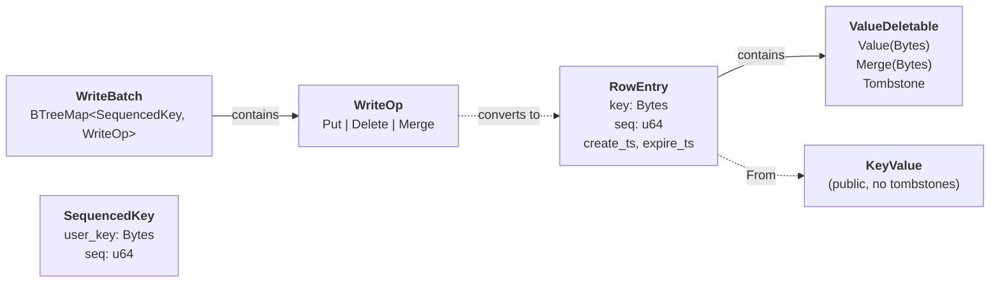

## TableStore & SST Format

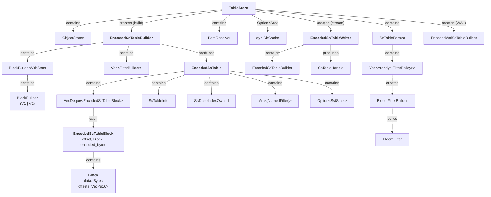

## Iterator Chain (Read Path)

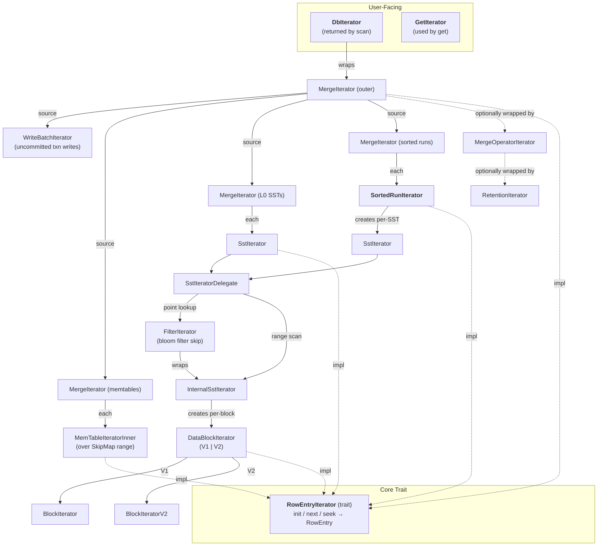

## Memtable Flush Pipeline

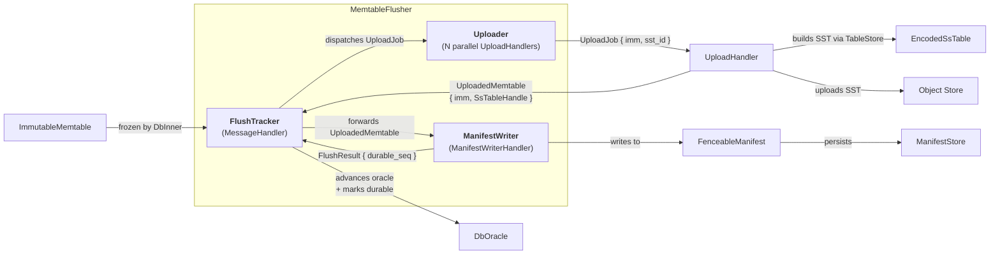

## Compactor

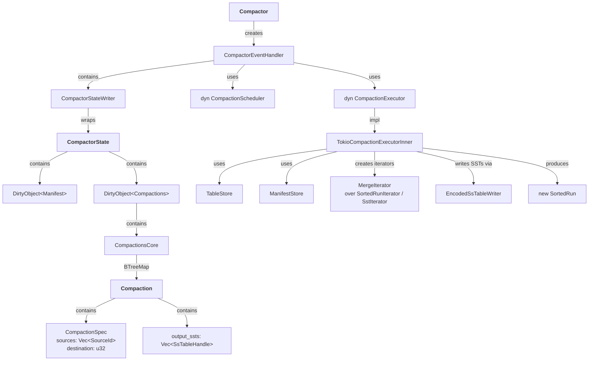

## WAL Buffer

```mermaid
graph TB
    WBMGR["<b>WalBufferManager</b>"]
    WBMGR -->|contains| WBMI["WalBufferManagerInner"]
    WBMGR -->|uses| TS3["Arc&lt;TableStore&gt;"]
    WBMGR -->|uses| MC["Arc&lt;MonotonicClock&gt;"]

    WBMI -->|current| WBuf["<b>WalBuffer</b><br/>VecDeque&lt;RowEntry&gt;"]
    WBMI -->|frozen| ImmWals["VecDeque&lt;(u64, Arc&lt;WalBuffer&gt;)&gt;"]
    WBMI -->|notifies| FlushTx["SafeSender&lt;WalFlushWork&gt;"]
    WBMI -->|uses| ORC2["Arc&lt;DbOracle&gt;"]

    WFH["<b>WalFlushHandler</b><br/>(background task)"]
    WFH -->|reads from| WBMGR
    WFH -->|"builds WAL SST"| EWSB2["EncodedWalSsTableBuilder"]
    WFH -->|"uploads to"| ObjStore2["Object Store"]
```

## Garbage Collector

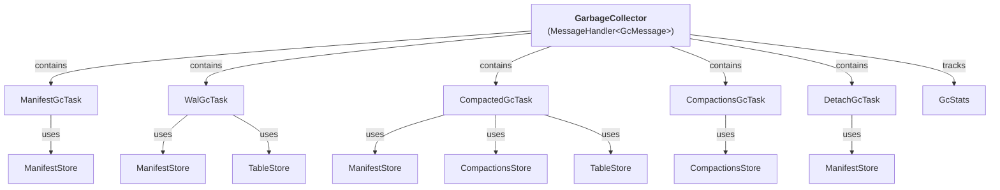

## Transactions, Snapshots & Oracle

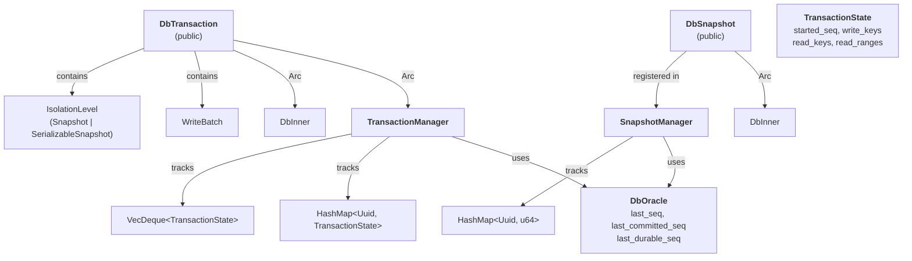

## Read-Only Reader (DbReader)

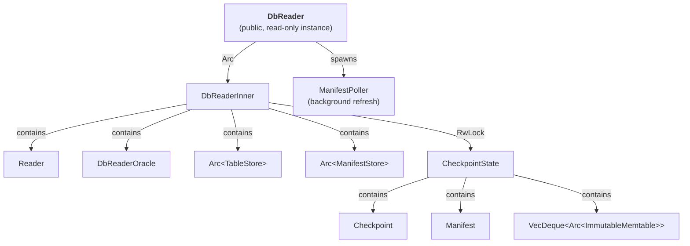

## Cache Layer

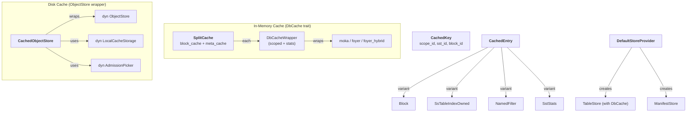

## Store Layer

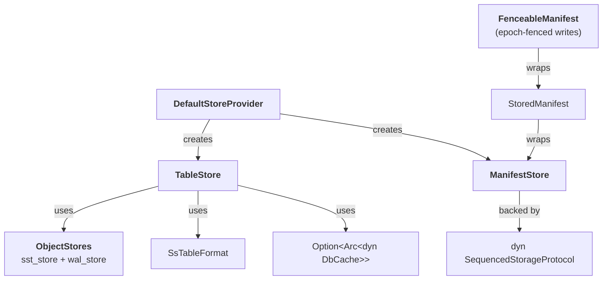

## Background Task Dispatch

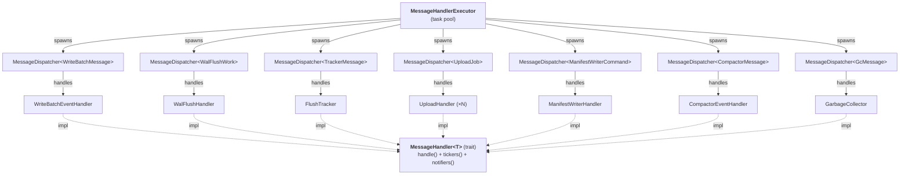

## Data Flow Summary

```
Write Path:
  Db::put/merge/delete
    → WriteBatch → WriteBatchMessage → WriteBatchEventHandler
    → RowEntry written to KVTable (memtable) + WalBuffer
    → WalFlushHandler flushes WalBuffer → WAL SST on object store
    → DbInner freezes memtable → ImmutableMemtable
    → FlushTracker → Uploader builds SST → uploads
    → ManifestWriter updates manifest with new L0 SsTableView

Read Path:
  Db::get/scan
    → Reader builds iterator chain
    → MergeIterator over: memtable + imm memtables + L0 SSTs + sorted runs
    → SstIterator (with bloom filter skip) → Block decoding
    → MergeOperatorIterator resolves merge operands
    → DbIterator yields KeyValue to user

Compaction:
  Compactor polls manifest for new L0 SSTs
    → CompactionScheduler decides what to compact
    → CompactionExecutor merges SSTs via MergeIterator
    → Writes new SortedRun SSTs via EncodedSsTableWriter
    → Updates manifest (removes old L0s, adds new sorted runs)

Garbage Collection:
  GarbageCollector runs periodic tasks
    → WalGcTask: removes old WAL SSTs no longer needed
    → CompactedGcTask: removes SSTs replaced by compaction
    → ManifestGcTask: removes old manifest versions
    → CompactionsGcTask: removes old compaction state files
    → DetachGcTask: detaches expired external DB references
```
