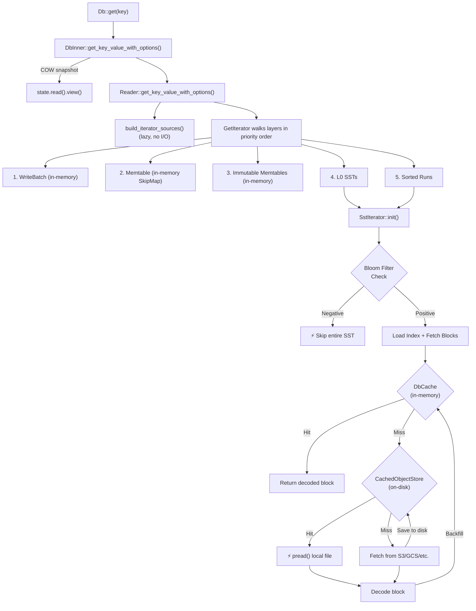

# SlateDB Read Path: `Db::get` → Filesystem Cache

This document traces the complete read path for a point lookup (`get`) from the
public API down through all three cache layers to the remote object store.

## Cache Layers Overview

A read can pass through **three cache layers**, each serving a different purpose:

| Layer | Type | What it caches | Effect on miss |
|-------|------|----------------|----------------|
| **Bloom Filter** | In-memory (or cached) | Key membership per SST | Entire SST skipped if key definitely absent |
| **`DbCache`** | In-memory (Moka/Foyer) | Decoded blocks, indices, filters, stats | Falls through to object store |
| **`CachedObjectStore`** | On-disk (local filesystem) | Raw object store bytes as 4 MB part files | Falls through to remote (e.g. S3) |

## High-Level Flow



## Step-by-Step Walkthrough

### 1. Entry Point → Reader

```rust
// db.rs
pub async fn get<K: AsRef<[u8]> + Send>(&self, key: K) -> Result<Option<Bytes>> {
    self.get_with_options(key, &ReadOptions::default()).await
}
```

This delegates through `Db` → `DbInner` → `Reader`:

```rust
// db.rs — DbInner
pub(crate) async fn get_key_value_with_options<K: AsRef<[u8]>>(
    &self, key: K, options: &ReadOptions,
) -> Result<Option<KeyValue>, SlateDBError> {
    self.check_closed()?;
    let db_state = self.state.read().view();   // COW snapshot
    self.reader
        .get_key_value_with_options(key, options, &db_state, None, None)
        .await
}
```

`state.read().view()` takes a **copy-on-write snapshot** of `DbState` — the active
memtable, immutable memtables, and manifest (L0 SSTs + sorted runs) are all captured
at this point with no locks held during the rest of the read.

### 2. Reader Fans Out Across All Data Layers

`Reader::get_key_value_with_options` calls `build_iterator_sources`, which creates
**lazy, uninitialized** iterators over every layer:

```rust
// reader.rs
fn build_point_l0_iters(&self, range, key, db_state, opts, stats)
    -> Result<VecDeque<Box<dyn RowEntryIterator>>>
{
    let mut iters = VecDeque::new();
    for sst in &db_state.core().l0 {
        if !sst.contains_key(key) { continue; }  // cheap key-range check
        let iterator = SstIterator::new_owned_with_stats(
            range, sst, table_store, opts, stats,
        )?;
        if let Some(iterator) = iterator {
            iters.push_back(Box::new(iterator));
        }
    }
    Ok(iters)
}
```

**No I/O happens yet.** Each `SstIterator` just stores a reference to the
`SsTableView` and the `TableStore`. The same pattern applies for sorted runs
via `build_point_sr_iters`.

### 3. `GetIterator` Short-Circuits by Layer Priority

All iterators are handed to a `GetIterator`, which walks them **in priority order**:

```rust
// db_iter.rs
async fn next(&mut self) -> Result<Option<RowEntry>, SlateDBError> {
    while self.idx < self.iters.len() {
        self.iters[self.idx].init().await?;    // lazy init — first I/O here
        let result = self.iters[self.idx].next().await?;
        if let Some(entry) = result {
            match &entry.value {
                ValueDeletable::Tombstone => return Ok(None),  // key deleted
                _ => return Ok(Some(entry)),                   // found it
            }
        }
        self.idx += 1;  // nothing at this level, try deeper
    }
    Ok(None)
}
```

The iteration order is:

1. **Write batch** (uncommitted transaction writes)
2. **Active memtable** (in-memory `SkipMap`)
3. **Immutable memtables** (frozen, pending flush)
4. **L0 SSTs** (recently flushed, not yet compacted)
5. **Sorted runs** (compacted SSTs)

The moment any level has the key (or a tombstone), **deeper levels are never
touched**. No `init()` is called on skipped iterators, meaning zero I/O for
lower levels.

### 4. `SstIterator` Checks the Bloom Filter First

When a point lookup reaches an SST iterator, `init()` triggers the
`FilterIterator`, which loads the bloom filter **before** loading any data blocks:

```rust
// sst_iter.rs — FilterIterator
async fn init(&mut self) -> Result<(), SlateDBError> {
    if !self.initialized {
        // Load bloom filter (goes through DbCache → CachedObjectStore → remote)
        let filters = self.inner.table_store()
            .read_filters(&self.inner.view().table_as_ref().sst, cache_blocks)
            .await?;
        self.filter.evaluate(&filters).await;

        if self.is_filtered_out() {
            return Ok(());  // ⚡ SST skipped — no index, no blocks loaded
        }

        self.inner.init().await?;  // only if filter says "maybe present"
        self.initialized = true;
    }
    Ok(())
}
```

The filter evaluation uses AND logic across all configured filter policies. If
**any** filter says the key is definitely not present, the entire SST is skipped.

### 5. On Filter Positive: Load Index, Then Fetch Blocks

If the bloom filter says "maybe present", the SST index is loaded lazily:

```rust
// sst_iter.rs — InternalSstIterator
async fn ensure_metadata_loaded(&mut self) -> Result<(), SlateDBError> {
    if self.index.is_none() {
        let index = self.table_store
            .read_index(&self.view.table_as_ref().sst, self.options.cache_blocks)
            .await?;
        let block_idx_range = Self::blocks_covering_view(&index.borrow(), &self.view);
        self.index = Some(index);
        if self.options.eager_spawn {
            self.spawn_fetches();  // kick off block reads immediately
        }
    }
    Ok(())
}
```

Then `spawn_fetches` spawns Tokio tasks calling `table_store.read_blocks_using_index()`:

```rust
// sst_iter.rs
fn spawn_fetches(&mut self) {
    while self.fetch_tasks.len() < self.options.max_fetch_tasks
        && self.block_idx_range.contains(&self.next_block_idx_to_fetch)
    {
        let blocks_to_fetch = min(
            self.options.blocks_to_fetch,
            self.block_idx_range.end - self.next_block_idx_to_fetch,
        );
        // ...
        self.fetch_tasks.push_back(FetchTask::InFlight(tokio::spawn(async move {
            table_store
                .read_blocks_using_index(&table, index, blocks_start..blocks_end, cache_blocks)
                .await
        })));
        self.next_block_idx_to_fetch = blocks_end;
    }
}
```

For point lookups, `eager_spawn: true` ensures block fetches are kicked off as
soon as the index is loaded.

### 6. `TableStore` — The In-Memory Cache Layer (`DbCache`)

Every `TableStore` read method follows the same pattern:
**check `DbCache` → miss → read from object store → backfill cache**.

For data blocks, the implementation coalesces consecutive cache misses into
contiguous byte-range reads:

```rust
// tablestore.rs
pub(crate) async fn read_blocks_using_index(
    &self, handle, index, blocks: Range<usize>, cache_blocks: bool,
) -> Result<VecDeque<Arc<Block>>, SlateDBError> {
    let mut blocks_read = VecDeque::new();
    let mut uncached_ranges = Vec::new();

    // 1. Concurrent cache probe — look up all requested blocks at once
    if let Some(ref cache) = self.cache {
        let cached_blocks = join_all(blocks.clone().map(|block_num| async move {
            cache.get_block(&(handle.id, offset).into()).await
        })).await;

        // 2. Merge hits; coalesce consecutive misses into contiguous ranges
        for (index, block_result) in cached_blocks { /* ... */ }
    }

    // 3. Fetch uncached ranges concurrently from object store
    let uncached_blocks = join_all(uncached_ranges.iter().map(|range| {
        self.sst_format.read_blocks(&handle.info, &index, range, &obj).await
    })).await;

    // 4. Backfill cache with newly read blocks
    if let Some(ref cache) = self.cache {
        join_all(blocks_to_cache.into_iter().map(|(id, offset, block)| {
            cache.insert((id, offset).into(), CachedEntry::with_block(block))
        })).await;
    }

    Ok(blocks_read)
}
```

The `DbCache` trait is implemented by `MokaCache` (in-memory LRU) and Foyer
variants (hybrid memory+disk). `SplitCache` routes block lookups to a
`block_cache` and metadata lookups (index, filters, stats) to a `meta_cache`.
`DbCacheWrapper` adds per-`Db` scoping (so multiple `Db` instances sharing a
cache don't collide) and hit/miss metrics.

### 7. `SsTableFormat` → Object Store → `CachedObjectStore` (Disk Cache)

When `DbCache` misses, `SsTableFormat::read_blocks` calls `obj.read_range(byte_range)`.
The `obj` wraps the `ObjectStore`, which — if configured — is actually a
`CachedObjectStore` that implements the `ObjectStore` trait transparently.

#### How `CachedObjectStore` works

Objects are split into **fixed-size parts** (default 4 MB). Every `get_opts` call
goes through `cached_get_opts`:

1. **Check for cached head** (metadata) on local disk
2. **Split the requested byte range into parts**
3. **For each part**, check local disk → hit returns via `pread()`; miss fetches
   from remote and saves to disk

```rust
// cached_object_store/object_store.rs
fn read_part(&self, location, part_id, range_in_part) -> BoxFuture<Result<Bytes>> {
    // 1. Try local disk first
    if let Some(cache_location) = this.cache_location_for(&location) {
        let entry = this.cache_storage.entry(&cache_location, this.part_size_bytes);
        if let Ok(Some(bytes)) = entry.read_part(part_id, range_in_part).await {
            // ⚡ Disk cache hit — pread() from local file
            return Ok(bytes);
        }
    }

    // 2. Cache miss — fetch the whole part from remote (e.g. S3)
    let get_result = this.object_store.get_opts(&location, GetOptions {
        range: Some(GetRange::Bounded(part_range)),  // full 4MB part
        ..Default::default()
    }).await?;

    // 3. Save to disk for next time (atomic: write tmp → fsync → rename)
    if let Some(entry) = cache_entry {
        entry.save_head((&meta, &attrs)).await.ok();
        entry.save_part(part_id, bytes.clone()).await.ok();
    }

    Ok(bytes.slice(range_in_part))
}
```

#### On-disk layout

```
{cache_root}/
  {object_path}/
    _head                    # JSON metadata (ObjectMeta + Attributes)
    _part4mb-000000000       # Part 0 (raw bytes, up to 4 MB)
    _part4mb-000000001       # Part 1
    _part4mb-000000003       # Part 3 (parts can be sparse)
```

#### Implementation details

- **Reads** use `pread` (positional I/O) with a `FileHandleCache` (`HashMap<PathBuf, Arc<File>>`)
  so multiple threads can read the same file concurrently without seeking
- **Writes** are atomic: write to a temp file → `fsync` → rename
- **Eviction** uses a background task with **pick-of-2 approximate LRU**: when cache
  exceeds `max_cache_size_bytes`, two random entries are sampled and the
  least-recently-accessed one is evicted, repeating until the cache is at 90% capacity
- **Backpressure**: the evictor uses a bounded channel (capacity 100). If full,
  disk cache writes are silently skipped — the system never blocks on caching
- **Admission**: currently `AdmitAll` (everything gets cached). The `AdmissionPicker`
  trait is an extension point for future policies

## Complete Call Chain Summary

```
Db::get(key)
  └─ DbInner::get_key_value_with_options()
       ├─ state.read().view()                          // COW snapshot
       └─ Reader::get_key_value_with_options()
            ├─ build_iterator_sources()                 // lazy, no I/O
            └─ GetIterator walks layers:
                 ┌─ write batch ────────── (in-memory)
                 ├─ memtable ──────────── (in-memory SkipMap)
                 ├─ immutable memtables ── (in-memory)
                 ├─ L0 SSTs ──────┐
                 └─ sorted runs ──┤
                                  ▼
                 SstIterator::init()
                   │
                   ├─ FilterIterator: table_store.read_filters()
                   │    ├─ DbCache hit? ─────────── return cached filter
                   │    └─ DbCache miss ─────────── SsTableFormat.read_filters()
                   │         └─ ObjectStore.get_range()
                   │              └─ CachedObjectStore.read_part()
                   │                   ├─ disk hit? ── pread() local file
                   │                   └─ disk miss? ─ fetch from S3 → save to disk
                   │
                   ├─ bloom filter negative? ──── SKIP entire SST ⚡
                   │
                   └─ bloom filter positive? ──── continue ↓
                        │
                        ├─ table_store.read_index()
                        │    ├─ DbCache hit? ─────── return cached index
                        │    └─ DbCache miss ─────── (same 3-tier path as above)
                        │
                        └─ table_store.read_blocks_using_index()
                             ├─ DbCache hit? ─────── return Arc<Block>
                             └─ DbCache miss ─────── SsTableFormat.read_blocks()
                                  └─ ObjectStore.get_range()
                                       └─ CachedObjectStore.read_part()
                                            ├─ disk hit? ── pread() ⚡
                                            └─ disk miss? ─ S3 → save to disk
```

## Key Insights

1. **Three cache tiers**: bloom filter (skip SSTs) → `DbCache` (in-memory decoded
   blocks) → `CachedObjectStore` (on-disk raw bytes). A cold read hits all three;
   a warm read typically only hits `DbCache`.

2. **`CachedObjectStore` is transparent** — it implements the `ObjectStore` trait, so
   `SsTableFormat` has zero knowledge of caching. The cache is injected at the
   object-store level during `Db` construction in `DbBuilder::build()`.

3. **Lazy initialization is critical** — `GetIterator` only calls `init()` on each
   iterator when it's that layer's turn. If the key is found in the memtable, no SST
   iterators are ever initialized and zero I/O occurs.

4. **The fs_cache chunks objects into fixed-size parts** (default 4 MB). Even if you
   only need one block (~4 KB), it fetches and caches the entire 4 MB part. This
   amortizes future reads to nearby blocks within the same SST.

5. **Cache backfill is opportunistic** — if the evictor's channel is full
   (backpressure), disk cache writes are silently skipped. The system never blocks
   on caching.

6. **Write-through on SST creation** — when `TableStore::write_sst()` creates a new
   SST (during flush or compaction), it pre-populates the `DbCache` with all blocks,
   index, and filters. This means freshly-written data is immediately cache-hot.